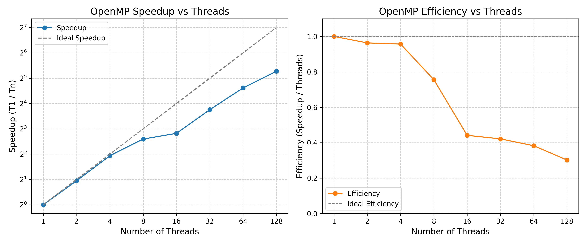
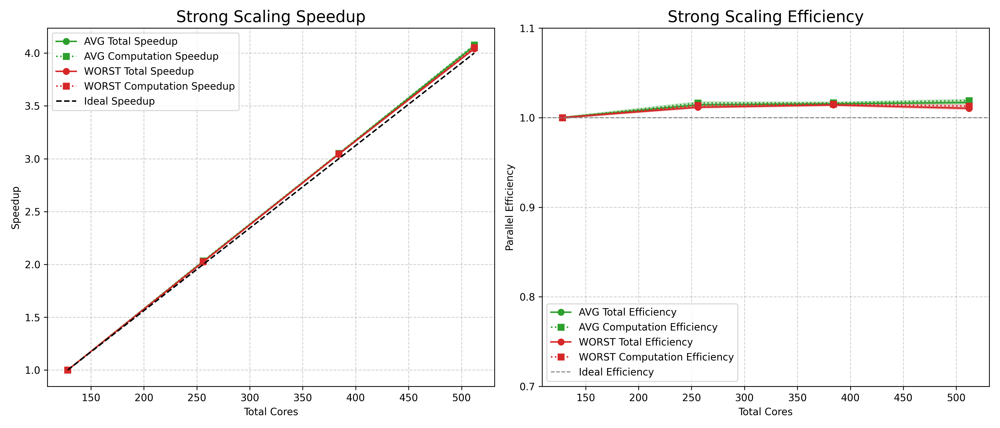
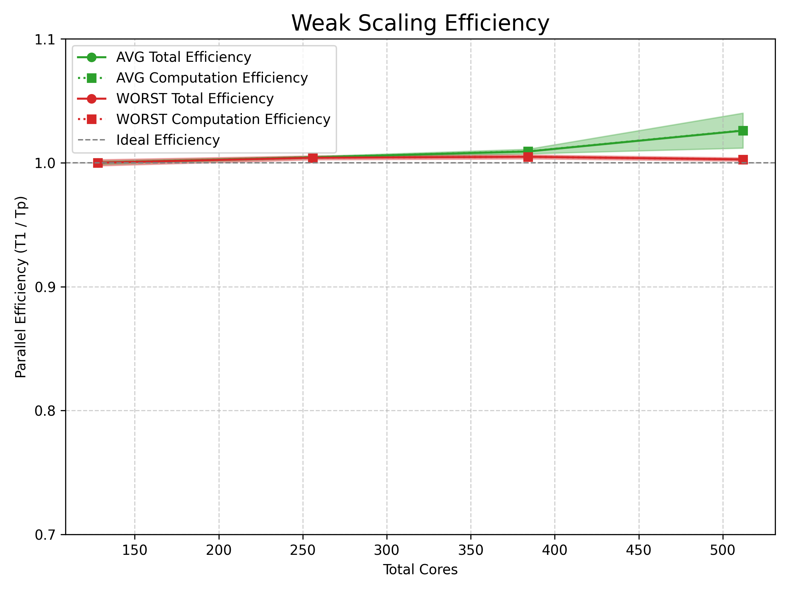

# **The stencil method**

## **Introduction**

The following repository was created to present my personal project for the final 
exam of High Performance Computing.
The assigned problem involved the optimization and parallelization of a heat 
diffusion simulation using a 5-point stencil update. More specifically, the goal 
was to use OpenMP and MPI in order to speedup the computations.

## **Implementation**

The workflow can be roughly divided into three parts: an initial allocation of memory
and initialization of resources, followed by the main diffusion cycle, and finally the
results gathering and memory release.

### Initialization

In the initial step the program sets up the parallel environment and 
prepares the data structures needed by the simulation.  
MPI is started and each process stores its rank and the total number of ranks. 

After that, the global 2D plate is decomposed across the MPI ranks: each process
is assigned a rectangular patch and identifies its four neighbours 
(north/south/east/west), if present.
Two local grids are allocated (old/new) including a one-cell halo around each patch,
which is designed to store boundary values received from neighbours.
Heat sources are distributed among processes and stored locally.


### Heat injection

After the initialization is complete, the main loop starts by injecting heat into
each process's local heat source.

### Buffer packing

Next, each process packs its buffers in order to communicate boundary data with 
their neighbors. Since the local grids are stored in row-major order, instead of 
packing data for their north and south neighbors, it's sufficient to set the 
send buffer as a pointer to the start of the north/south border, 
as shown in the following:
```c
buffers[SEND][NORTH] = &old[fx + 1]; // fx is horizontal size of patch +2
...
buffers[SEND][SOUTH] = &old[ny * fx + 1]; // ny is vertical size of patch
```
While for the east/west buffers we need to pack individual data since values are
not stored contiguously in memory. Hence we do:
```c
buffers[SEND][WEST][j] = old[(j+1)*fx + 1];
...
buffers[SEND][EAST][j] = old[(j+1)*fx + nx];
```
then send a pointer to the start of the buffers and a count of doubles to 
read from there.

### Communication

For each existing neighbor (NORTH, SOUTH, WEST, EAST), we post a
nonblocking receive (MPI_Irecv) to fetch the neighbor's boundary
data into the corresponding halo buffer, and a nonblocking send
(MPI_Isend) to send our local boundary data.
```c
MPI_Irecv(buffers[RECV][NORTH], nx, MPI_DOUBLE,
          neighbours[NORTH], 100, myCOMM_WORLD, &reqs[rq++]);
          
MPI_Isend(buffers[SEND][NORTH], nx, MPI_DOUBLE,
          neighbours[NORTH], 200, myCOMM_WORLD, &reqs[rq++]);
...
```
Different message tags are used for opposite directions to avoid
message matching conflicts.

As discussed before, North/South exchanges transfer contiguous rows of nx elements,
while West/East exchanges transfer ny-element packed buffers
corresponding to vertical boundary columns.

All requests are posted and later completed with MPI_Waitall,
allowing computation on the inner part of the patches to overlap with communication, 
since they don't require halo knowledge.

### Halo unpacking

After finishing the inner patches computation, recieved buffers gets unpacked into
the local grids, mainly West/East buffers, since North/South were directly sent
to the patch's halo rows. From there, halo points are updated and the computation
for new boundary data can begin.

Lastly, with a pointer switch, the new local grids become the old ones and we are
ready for a new iteration of the main loop.

### Computation

As we have alredy seen, computation is split across two phases, the first
update happens after posting the Send/Recieve requests, since it does not require
knowledge about the halo points, hence it can run while neighbors are communicating. 
The second one, involving the patches' border, happens after communication is 
completed, and after the inner part of the patches are updated.

The actual update is carried out with multithreading using OpenMP:
```c
#pragma omp parallel for schedule(static)
```
which tells the compiler to split the following for loop evenly and deterministically
between threads. Since we are updating a grid of points we need to iterate through
2 dimensions, so the update consists of two loops, the one that gets parallelized
is only the first one, which was set to be the row division since patches are 
stored as row-major in memory. There could have been potential to parallelize
both loops with *collapse* but it was not required because of this nice storing
property.

### Finalization

During initialization, each process gets equipped with timers
in order to determine the effective benefits of running multiple processes.
When all iterations are complete, each process share its timings through 
MPI_Recieve, to determine both the mean and max time they took in order to run
the computation and communication, separately.
```c
MPI_Reduce(&local_comp,  &max_comp,   1, MPI_DOUBLE, MPI_MAX, 0, myCOMM_WORLD);
MPI_Reduce(&local_comm,  &max_comm,   1, MPI_DOUBLE, MPI_MAX, 0, myCOMM_WORLD);
...
MPI_Reduce(&local_comp,  &sum_comp,   1, MPI_DOUBLE, MPI_SUM, 0, myCOMM_WORLD);
MPI_Reduce(&local_comm,  &sum_comm,   1, MPI_DOUBLE, MPI_SUM, 0, myCOMM_WORLD);
```
We are interested in what was the max time, since a program time to execute is
determined by its slowest process, hence in the results obtained we will 
consider with more weight the slowest process' performance.

## **Scaling analysis**

Scalability tests were carried on the ORFEO cluster using the EPYC partition, 
consisting of 8 nodes equipped with 2 × AMD EPYC 7H12 processors (128 cores per node). 

In the first part there was a need to determine the optimal number of 
threads-per-process. This experiment was conducted using a single node, while the
second part, where we needed to perform strong and weak scaling analysis, was
executed using up to 4 full nodes.

Before running, the program was compiled with the following line:
```c
mpicc -fopenmp -Iinclude src/stencil_template_parallel.c -o stencil
```
where mpicc is the MPI C compiler wrapper, and -fopenmp enables OpenMP support.

In order to quantify performance, we are going to use *speedup* and *efficiency*.

Speedup is defined as:

  - S(p) = T<sub>1</sub> / T<sub>p</sub>

where:

- $T_1$ is the execution time using 1 full node
- $T_p$ is the execution time using p full nodes

The ideal speedup is linear scaling with slope 1.

Efficiency measures how effectively the additional resources are used:

  - E(p) = S(p) / p = T<sub>1</sub> / (p T<sub>p</sub>)

An efficiency of 1 (or 100%) corresponds to perfect utilization of all cores.

Running the computations on small patches would produce misleading results since
L3 caches would store most of the data, hence in order to obtain faithful results,
a bigger grid needs to be set. 
For the following results a grid of 100k x 50k points was used, which corresponds
to 40GB of memory, times the 2 planes makes it 80GB.

### Optimal threads-per-node ratio

Since our goal was to fill entire nodes for the scaling analysis, there was a
need to determine the optimal number of threads each process needed in order
to achieve the best speedup.

Hence, after compiling the code, the *openmp.sh* job was submitted, which runs
the program each time with an increasing number of threads, up to filling
the entire node. More specifically, the number of theads considered are: 1, 2, 4,
8, 16, 32, 64, 128. Each thread instance gets computed 3 separated times in order
to account for runtime variability.

From the following plot, on the left panel, we can appreciate the results 
obtained in terms of mean speedup, which effectively is the ratio between 
the time the program with a single thread took to complete divided the time it 
took for n threads. On the right panel, instead, we can see the same results
but in terms of efficiency, which is the ratio between the speedup and number
of threads used.



From the plots, we can see that scaling is nearly optimal (95% efficiency) 
up until 4 threads, then it worsens to about 75% at 8 threads, before dropping to 40%.
The workload becomes memory-bandwidth-bound at around 8 threads; beyond that 
point, threads increasingly compete for DRAM bandwidth and cache capacity, 
causing efficiency to drop sharply.

Taking this into consideration, 8 threads per process were selected as a good 
trade-off.

### Strong scaling

We analyze strong scaling because it tells us whether adding more compute 
resources actually makes our fixed-size problem run faster, and if those extra
resources are being used efficiently.

Both the strong and weak scaling analysis were carried out on a maximum of 4 full 
nodes. In the previous experiment we selected 8 threads-per-process, so in order
to fill a node of 128 cores we used 16 processes per node.

From the following figure we can appreciate the strong scaling results:



As we can see, ideal scaling was achieved, even for the worst case, which
we discussed before as being the most important one since it dictates the actual
runtime. 

### Weak scaling

For the weak scaling analysis, the same 4 full nodes were used, but this time
instead of just adding resources, at each step the size of the problem was
increased proportionally to the number of nodes used.

From the following figure we can see the results:



This time we only look at efficiency, since speedup would have a different
meaning. Again, ideal scaling was achieved, signaling that the implemented 
parallelization managed to use resources nearly as best as possible.

### Plotting

In order to produce the plots shown in this repository, after running the
*mpi.sh* script which produces csvs as output in the *csv* directory, run:
```bash
python plot_functions.py
```
which will produce the images in the *images* directory.
